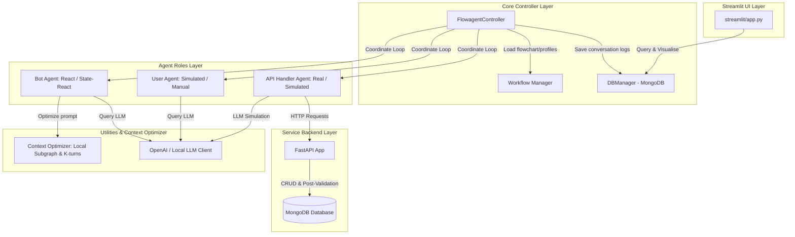

# Kiến Trúc Hệ Thống FlowAIssistant

FlowAIssistant là một hệ thống hội thoại thông minh dựa trên hướng tiếp cận lai (hybrid approach), kết hợp giữa khả năng xử lý ngôn ngữ tự nhiên linh hoạt của các **mô hình ngôn ngữ lớn (LLMs)** và tính quy trình logic, minh bạch của **Flowchart** (được biểu diễn bằng sơ đồ Mermaid). 

Hệ thống được thiết kế hướng tới giải quyết các bài toán hội thoại đa bước đòi hỏi tính tuân thủ quy trình khắt khe như hỗ trợ kỹ thuật, dịch vụ công, y tế hay tài chính, nhằm loại bỏ hiện tượng ảo giác (hallucination) của LLM trong nghiệp vụ.

---

## 1. Sơ đồ Kiến trúc Tổng quan (High-Level Architecture)

Dưới đây là sơ đồ tương tác giữa các lớp nghiệp vụ trong FlowAIssistant:



---

## 2. Chi tiết các Tầng Kiến trúc (Component Details)

### 2.1. Core Controller Layer (Tầng điều phối trạng thái)
Tầng này nằm tại thư mục `controller/`, đóng vai trò là "xương sống" để kết nối các Agent và quản lý luồng hội thoại.
*   **`flowagent.py` (`FlowagentController`)**: Quản lý vòng lặp hội thoại chính. Điều phối lượt chat giữa `User`, `Bot` và `API`. Nếu Bot trả về hành vi gọi hàm (`BotOutputType.ACTION`), controller sẽ kích hoạt `APIHandler` xử lý rồi chuyển kết quả cho Bot tiếp tục suy luận.
*   **`workflow.py` (`Workflow` & `DataManager`)**: Quản lý và tải dữ liệu nghiệp vụ:
    *   Tải sơ đồ quy trình dạng flowchart (file `.md` với cú pháp Mermaid) từ `dataset/STAR/flowchart/`.
    *   Tải danh sách các API hỗ trợ tương ứng từ `dataset/STAR/tools/`.
    *   Tải hồ sơ người dùng (`UserProfile`) từ `dataset/STAR/user_profile/` để phục vụ giả lập.
*   **`db.py` (`DBManager`)**: Chịu trách nhiệm tương tác trực tiếp với cơ sở dữ liệu MongoDB để lưu trữ/truy vấn cấu hình thử nghiệm, lịch sử tin nhắn và kết quả đánh giá chất lượng.
*   **`base_data.py`**: Định nghĩa cấu trúc dữ liệu cốt lõi như `Message`, `Conversation`, và enum `Role` (`USER`, `BOT`, `SYSTEM`).

### 2.2. Agent Layer (Tầng tác nhân hội thoại)
Nằm tại thư mục `agents/`, định nghĩa các vai trò tham gia vào phiên hội thoại:
*   **Bot Agent (`bot.py`)**:
    *   `ReactBot`: Hoạt động theo cơ chế ReAct (Thought ➡️ Action/Action Input hoặc Response). Prompt hệ thống được dựng qua Jinja template `flowagent/bot_flowbench.jinja`.
    *   `StateReactBot` (Khuyên dùng): Yêu cầu LLM dự đoán "State" hiện tại trước khi sinh Thought/Response để tăng độ chính xác trong bám đuổi quy trình. Chuỗi State này được dùng để định vị node hiện tại trên Flowchart.
*   **User Agent (`user.py`)**:
    *   `InputUser`: Cho phép con người nhập nội dung hội thoại trực tiếp qua CLI terminal.
    *   `LLMSimulatedUserWithProfile`: Giả lập người dùng bằng LLM, phản hồi dựa trên bối cảnh và mục tiêu được cung cấp trong `UserProfile`.
    *   `LLMSimulatedUserWithOOW`: Giả lập người dùng có hành vi chệch hướng quy trình (Out-of-Workflow) như đổi ý giữa chừng hoặc đưa ra các câu hỏi/yêu cầu không liên quan nhằm kiểm tra độ bền bỉ (robustness) của Bot.
*   **API Handler Agent (`api.py`)**:
    *   `LLMSimulatedAPIHandler`: Dùng LLM để tự sinh dữ liệu giả lập cho các API gọi ra ngoài.
    *   `RealAPIHandler`: Thực hiện gọi API thực tế tới Backend qua giao thức HTTP POST.

### 2.3. Service Backend Layer (Tầng dịch vụ & Dữ liệu)
Nằm tại thư mục `backend/`, cung cấp các endpoint API nghiệp vụ thật và kiểm soát tính toàn vẹn dữ liệu.
*   **`app.py` (FastAPI + MongoDB)**:
    *   Cung cấp các API nghiệp vụ chính: Đặt lịch khám bệnh (`/api/doctor_schedule`) và xem căn hộ (`/api/book_apartment_viewing`).
    *   **Cơ chế Post-Validation**: Khi nhận được lệnh đặt chỗ (`Book`) từ API Handler, Backend sẽ lưu thông tin vào cơ sở dữ liệu MongoDB, sau đó thực hiện kiểm tra chéo (validate) dữ liệu vừa lưu bằng Pydantic Model.
    *   Nếu phát hiện trường dữ liệu bị thiếu hoặc sai định dạng (do LLM điền lỗi), Backend sẽ thực hiện **clean-up** (tự động xóa bản ghi lỗi khỏi DB) và trả về mã trạng thái lỗi `500 POST_VALIDATION_FAILED` cùng cờ `restart_workflow: true` để yêu cầu hệ thống phía trước reset lại trạng thái hội thoại.

### 2.4. UI Layer (Tầng giao diện lập trình viên)
Nằm tại thư mục `ui/`, sử dụng Streamlit để cung cấp công cụ trực quan hóa cho nhà phát triển.
*   **`app.py`**: Điểm khởi chạy giao diện.
*   **`show_data.py`**: Hiển thị bảng tổng hợp dữ liệu chạy thử nghiệm, phân tích phân phối lỗi và tiến độ.
*   **`show_conversation.py`**: Trực quan hóa chi tiết từng cuộc hội thoại đã được ghi nhận trong MongoDB:
    *   Xem chi tiết từng tin nhắn, vai trò gửi.
    *   Xem chi tiết **System Prompt thực tế** đã gửi lên LLM tại thời điểm đó cùng raw response của LLM.
    *   Xem thông tin User Profile mục tiêu và kết quả chấm điểm Compliant/Goal Completion tự động của phiên hội thoại đó.

### 2.5. Evaluation Layer (Tầng kiểm soát chất lượng & Đánh giá)
Nằm tại thư mục `eval/`, dùng để đánh giá tự động các phiên hội thoại mô phỏng.
*   **`evaluator.py` & `judger.py`**: Chạy hàng loạt cuộc hội thoại mô phỏng và sử dụng LLM làm giám khảo (LLM-as-a-judge) chấm điểm tự động các chỉ số:
    *   **Goal Completion**: Người dùng giả lập có đạt được mục tiêu ban đầu đề ra trong profile không.
    *   **Adherence/Compliance**: Bot có tuân thủ đúng từng bước chuyển đổi trạng thái trong sơ đồ Flowchart hay không.
    *   **Duplicate API Calls**: Đếm số cuộc gọi API trùng lặp vô nghĩa (lỗi vòng lặp của Bot).

### 2.6. Utilities & Context Optimizer (Tầng tối ưu & Bổ trợ)
Nằm tại thư mục `utils/`, chứa các module tối ưu hóa cực kỳ quan trọng đối với chi phí và tốc độ xử lý:
*   **`context_optimizer.py` (Tối ưu hóa Ngữ cảnh)**:
    *   **Mermaid Parser**: Phân tích cú pháp chuỗi Mermaid của sơ đồ Flowchart để dựng cấu trúc đồ thị định hướng (`FlowGraph`).
    *   **Local Subgraph Extractor**: Thực hiện thuật toán BFS từ node hiện tại để cắt flowchart lớn thành một phân đoạn đồ thị lân cận (mặc định lấy `depth_forward=2` và `depth_backward=1`), chỉ đưa phân đoạn này vào System Prompt.
    *   **K-turns History Trimmer**: Cắt gọn lịch sử hội thoại, chỉ gửi tối đa `K` lượt chat gần nhất (`k_turns=6`) để ngăn chặn việc tràn Context Window và giảm độ nhiễu thông tin cho LLM.
    *   **State Inference**: Suy luận node hiện tại bằng cách so khớp regex ID dạng `SKXXX` trong chuỗi trạng thái mà LLM sinh ra hoặc so khớp fuzzy keyword.
*   **`openai_client.py`**: Wrapper xử lý giao tiếp API với các mô hình LLM tương thích (OpenAI API, LM Studio Local Server).

---

## 3. Quy trình Hội thoại Chi tiết (Detail Dialogue Flow)

```mermaid
sequenceDiagram
    autonumber
    actor User as User Agent
    participant FC as FlowagentController
    participant Bot as Bot Agent
    participant Opt as Context Optimizer
    participant API as API Handler Agent
    participant BE as Backend (FastAPI)

    Note over User, BE: Khởi động phiên hội thoại từ trạng thái đầu SK000
    User->>FC: Gửi tin nhắn đầu tiên (User query)
    loop Conversation Loop
        FC->>Bot: Yêu cầu sinh phản hồi tiếp theo
        Bot->>Opt: Lấy subgraph lân cận & K-turns history
        Opt-->>Bot: Trả về prompt tối ưu ngữ cảnh
        Bot->>Bot: Gọi LLM (Thought + Action/Response)
        
        alt Bot quyết định gọi hàm (BotOutputType.ACTION)
            Bot-->>FC: Trả về Action name + Input parameters
            FC->>API: Gọi API Handler tương ứng
            alt API là RealAPIHandler
                API->>BE: Gọi HTTP POST request
                BE->>BE: Thực hiện Nghiệp vụ & Post-Validation
                BE-->>API: Trả về kết quả (JSON + Status Code)
            else API là LLMSimulatedAPIHandler
                API->>API: Dùng LLM sinh kết quả giả lập
            end
            API-->>FC: Trả về APIOutput (Data, Status Code)
            FC->>FC: Thêm kết quả API (System role) vào Conversation
        else Bot quyết định trả lời người dùng (BotOutputType.RESPONSE)
            Bot-->>FC: Trả về văn bản phản hồi tự nhiên
            FC->>User: Chuyển tin nhắn của Bot tới người dùng
            User->>User: Dùng LLM (Simulated) để phân tích & sinh phản hồi mới
            User-->>FC: Gửi tin nhắn tiếp theo của User
        end
    end
```

---

## 4. Các điểm tối ưu kiến trúc nổi bật

1.  **Kiến trúc Lai (Hybrid Architecture)**: Giúp kiểm soát hành vi của mô hình ngôn ngữ lớn (LLM) bằng cấu trúc flowchart cố định. Phù hợp cho các hệ thống doanh nghiệp yêu cầu độ tin cậy tuyệt đối (Deterministic logic).
2.  **Tối ưu hóa Ngữ cảnh Động (Dynamic Context Windowing)**: Việc chỉ truyền subgraph lân cận thay vì toàn bộ flowchart lớn giúp **tiết kiệm Token** tiêu thụ, giảm chi phí vận hành đồng thời **tăng độ chính xác** bám quy trình của LLM (LLM không bị nhầm lẫn giữa các nhánh xa nhau trên đồ thị).
3.  **Hệ thống Post-Validation tự động**: Đóng vai trò là chốt chặn cuối cùng ngăn chặn dữ liệu bẩn/lỗi tràn vào database thực tế bằng cách tự động dọn dẹp (clean-up) và gửi tín hiệu reset trạng thái trực tiếp thông qua API status code.
4.  **Tách biệt logic giả lập và thực tế**: Cấu trúc config linh hoạt cho phép chuyển đổi tức thì từ môi trường giả lập hoàn toàn (Simulated User + Simulated API) sang chạy thực tế hoặc bán thực tế (Manual User + Real API) thông qua tham số cấu hình.
